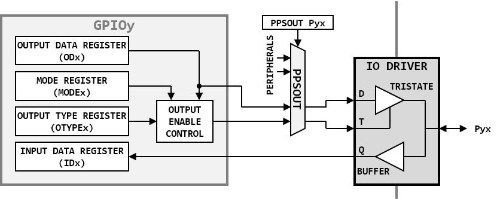

## General Purpose Inputs/Outputs (GPIO)

<br>GPIOA base address : 0x40000000
<br>GPIOB base address : 0x40000400
<br>GPIOC base address : 0x40000800
<br>GPIOD base address : 0x40000C00

##### I/O CONTROL WITH GPIO MODULE:


### Registers description

#### GPIO INPUT DATA REGISTER (IDR: BASE+0x00)

| Bit-31 | Bit-30 | Bit-29 | Bit-28 | Bit-27 | Bit-26 | Bit-25| Bit-24| Bit-23| Bit-22| Bit-21| Bit-20| Bit-19  | Bit-18|  Bit-17 | Bit-16 |
|:------:|:------:|:------:|:------:|:------:|:------:|:-----:|:-----:|:-----:|:-----:|:-----:|:-----:|:-------:|:-----:|:-------:|:------:|
| U-0    | U-0    | U-0    | U-0    | U-0    | U-0    | U-0   | U-0   | U-0   | U-0   | U-0   | U-0   | U-0     | U-0   | U-0     | U-0    |
| -      | -      | -      | -      | -      |-       | -     | -     | -     | -     | -     | -     | -       | -     | -       | -      |

| Bit-15 | Bit-14 | Bit-13 | Bit-12 | Bit-11 | Bit-10 | Bit-9 | Bit-8 | Bit-7 | Bit-6 | Bit-5 | Bit-4 |  Bit-3  | Bit-2 |  Bit-1  | Bit-0  |
|:------:|:------:|:------:|:------:|:------:|:------:|:-----:|:-----:|:-----:|:-----:|:-----:|:-----:|:-------:|:-----:|:-------:|:------:|
| R-X    | R-X    | R-X    | R-X    | R-X    | R-X    | R-X   | R-X   | R-X   | R-X   | R-X   | R-X   | R-X     | R-X   | R-X     | R-X    |
| ID15   | ID14   | ID13   | ID12   | ID11   |ID10    | ID9   | ID8   | ID7   | ID6   | ID5   | ID4   | ID3     | ID2   | ID1     | ID0    |

- Bit 15-0 **IDx:**
<br>Input data x
<br>These bits are read-only and contain the input value of the corresponding I/O pin

#### GPIO OUTPUT DATA REGISTER (ODR: BASE+0x04)

| Bit-31 | Bit-30 | Bit-29 | Bit-28 | Bit-27 | Bit-26 | Bit-25| Bit-24| Bit-23| Bit-22| Bit-21| Bit-20| Bit-19  | Bit-18|  Bit-17 | Bit-16 |
|:------:|:------:|:------:|:------:|:------:|:------:|:-----:|:-----:|:-----:|:-----:|:-----:|:-----:|:-------:|:-----:|:-------:|:------:|
| U-0    | U-0    | U-0    | U-0    | U-0    | U-0    | U-0   | U-0   | U-0   | U-0   | U-0   | U-0   | U-0     | U-0   | U-0     | U-0    |
| -      | -      | -      | -      | -      |-       | -     | -     | -     | -     | -     | -     | -       | -     | -       | -      |

| Bit-15 | Bit-14 | Bit-13 | Bit-12 | Bit-11 | Bit-10 | Bit-9 | Bit-8 | Bit-7 | Bit-6 | Bit-5 | Bit-4 |  Bit-3  | Bit-2 |  Bit-1  | Bit-0  |
|:------:|:------:|:------:|:------:|:------:|:------:|:-----:|:-----:|:-----:|:-----:|:-----:|:-----:|:-------:|:-----:|:-------:|:------:|
| R/W-0  | R/W-0  | R/W-0  | R/W-0  | R/W-0  | R/W-0  | R/W-0 | R/W-0 | R/W-0 | R/W-0 | R/W-0 | R/W-0 | R/W-0   | R/W-0 | R/W-0   | R/W-0  |
| OD15   | OD14   | OD13   | OD12   | OD11   |OD10    | OD9   | OD8   | OD7   | OD6   | OD5   | OD4   | OD3     | OD2   | OD1     | OD0    |

- Bit 15-0 **ODx:**
<br>Output data x

#### GPIO MODE REGISTER (MODER: BASE+0x08)

| Bit-31 | Bit-30 | Bit-29 | Bit-28 | Bit-27 | Bit-26 | Bit-25| Bit-24| Bit-23| Bit-22| Bit-21| Bit-20| Bit-19  | Bit-18|  Bit-17 | Bit-16 |
|:------:|:------:|:------:|:------:|:------:|:------:|:-----:|:-----:|:-----:|:-----:|:-----:|:-----:|:-------:|:-----:|:-------:|:------:|
| U-0    | U-0    | U-0    | U-0    | U-0    | U-0    | U-0   | U-0   | U-0   | U-0   | U-0   | U-0   | U-0     | U-0   | U-0     | U-0    |
| -      | -      | -      | -      | -      |-       | -     | -     | -     | -     | -     | -     | -       | -     | -       | -      |

| Bit-15 | Bit-14 | Bit-13 | Bit-12 | Bit-11 | Bit-10 | Bit-9 | Bit-8 | Bit-7 | Bit-6 | Bit-5 | Bit-4 |  Bit-3  | Bit-2 |  Bit-1  | Bit-0  |
|:------:|:------:|:------:|:------:|:------:|:------:|:-----:|:-----:|:-----:|:-----:|:-----:|:-----:|:-------:|:-----:|:-------:|:------:|
| R/W-0  | R/W-0  | R/W-0  | R/W-0  | R/W-0  | /WR0X  | R/W-0 | R/W-0 | R/W-0 | R/W-0 | R/W-0 | R/W-0 | R/W-0   | R/W-0 | R/W-0   | R/W-0  |
| MODE15 | MODE14 | MODE13 | MODE12 | MODE11 |MODE10  | MODE9 | MODE8 | MODE7 | MODE6 | MODE5 | MODE4 | MODE3   | MODE2 | MODE1   | MODE0  |

- Bit 15-0 **MODEx:**
<br>I/O x mode
<br>Pin mode when the corresponding PPSOUT register is set to ‘0’:
    - **0:** Input mode.
    - **1:** Output mode.

#### GPIO OUTPUT TYPE REGISTER (OTYPER: BASE+0x0C)

| Bit-31 | Bit-30 | Bit-29 | Bit-28 | Bit-27 | Bit-26 | Bit-25| Bit-24| Bit-23| Bit-22| Bit-21| Bit-20| Bit-19  | Bit-18|  Bit-17 | Bit-16 |
|:------:|:------:|:------:|:------:|:------:|:------:|:-----:|:-----:|:-----:|:-----:|:-----:|:-----:|:-------:|:-----:|:-------:|:------:|
| U-0    | U-0    | U-0    | U-0    | U-0    | U-0    | U-0   | U-0   | U-0   | U-0   | U-0   | U-0   | U-0     | U-0   | U-0     | U-0    |
| -      | -      | -      | -      | -      |-       | -     | -     | -     | -     | -     | -     | -       | -     | -       | -      |

| Bit-15 | Bit-14 | Bit-13 | Bit-12 | Bit-11 | Bit-10 | Bit-9 | Bit-8 | Bit-7 | Bit-6 | Bit-5 | Bit-4 |  Bit-3  | Bit-2 |  Bit-1  | Bit-0  |
|:------:|:------:|:------:|:------:|:------:|:------:|:-----:|:-----:|:-----:|:-----:|:-----:|:-----:|:-------:|:-----:|:-------:|:------:|
| R/W-0  | R/W-0  | R/W-0  | R/W-0  | R/W-0  | /WR0X  | R/W-0 | R/W-0 | R/W-0 | R/W-0 | R/W-0 | R/W-0 | R/W-0   | R/W-0 | R/W-0   | R/W-0  |
| OTYPE15| OTYPE14| OTYPE13| OTYPE12| OTYPE11|OTYPE10 | OTYPE9| OTYPE8| OTYPE7| OTYPE6| OTYPE5| OTYPE4| OTYPE3  | OTYPE2| OTYPE1  | OTYPE0 |

- Bit 15-0 **OTYPEx:**
<br>I/O x output type
<br>Output type when the corresponding PPSOUT register is set to ‘0’ and the MODEx bit is set (output mode).
    - **0:** Push-pull.
    - **1:** Open-drain.

### Register map

<table>
<thead>
  <tr>
    <th rowspan="2">Register</th>
    <th rowspan="2">Offset</th>
    <th colspan="32">Bits</th>
    <th rowspan="2">Reset value</th>
  </tr>
  <tr>
    <td>31</td>
    <td>30</td>
    <td>29</td>
    <td>28</td>
    <td>27</td>
    <td>26</td>
    <td>25</td>
    <td>24</td>
    <td>23</td>
    <td>22</td>
    <td>21</td>
    <td>20</td>
    <td>19</td>
    <td>18</td>
    <td>17</td>
    <td>16</td>
    <td>15</td>
    <td>14</td>
    <td>13</td>
    <td>12</td>
    <td>11</td>
    <td>10</td>
    <td>9</td>
    <td>8</td>
    <td>7</td>
    <td>6</td>
    <td>5</td>
    <td>4</td>
    <td>3</td>
    <td>2</td>
    <td>1</td>
    <td>0</td>
  </tr>
</thead>
<tbody>
  <tr>
    <td>IDR</td>
    <td>000</td>
    <td>-</td>
    <td>-</td>
    <td>-</td>
    <td>-</td>
    <td>-</td>
    <td>-</td>
    <td>-</td>
    <td>-</td>
    <td>-</td>
    <td>-</td>
    <td>-</td>
    <td>-</td>
    <td>-</td>
    <td>-</td>
    <td>-</td>
    <td>-</td>
    <td colspan="16">IDR&lt;15:0&gt;</td>
    <td>0000</td>
  </tr>
  <tr>
    <td>ODR</td>
    <td>004</td>
    <td>-</td>
    <td>-</td>
    <td>-</td>
    <td>-</td>
    <td>-</td>
    <td>-</td>
    <td>-</td>
    <td>-</td>
    <td>-</td>
    <td>-</td>
    <td>-</td>
    <td>-</td>
    <td>-</td>
    <td>-</td>
    <td>-</td>
    <td>-</td>
    <td colspan="16">ODR&lt;15:0&gt;</td>
    <td>0000</td>
  </tr>
  <tr>
    <td>MODER</td>
    <td>008</td>
    <td>-</td>
    <td>-</td>
    <td>-</td>
    <td>-</td>
    <td>-</td>
    <td>-</td>
    <td>-</td>
    <td>-</td>
    <td>-</td>
    <td>-</td>
    <td>-</td>
    <td>-</td>
    <td>-</td>
    <td>-</td>
    <td>-</td>
    <td>-</td>
    <td colspan="16">MODER&lt;15:0&gt;</td>
    <td>0000</td>
  </tr>
  <tr>
    <td>OTYPER</td>
    <td>00C</td>
    <td>-</td>
    <td>-</td>
    <td>-</td>
    <td>-</td>
    <td>-</td>
    <td>-</td>
    <td>-</td>
    <td>-</td>
    <td>-</td>
    <td>-</td>
    <td>-</td>
    <td>-</td>
    <td>-</td>
    <td>-</td>
    <td>-</td>
    <td>-</td>
    <td colspan="16">OTYPER&lt;15:0&gt;</td>
    <td>0000</td>
  </tr>
</tbody>
</table>

### Utilisation

```c
//enable PPS
RSTCLK.PPSINEN = RSTCLK.PPSOUTEN = 1;
//enable GPIOA
RSTCLK.GPIOAEN = 1;
//Set IO mode
GPIOA.MODER |= 0xFFFF;
//If set as output
GPIOA.ODR = 0xFFFF;
//If set as input
read = GPIOA.IDR;
```
