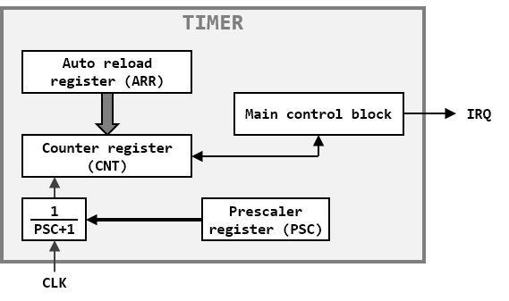

## Basic timer (TIMER)

<br>TIMER1 base address : 0x40018000
<br>TIMER2 base address : 0x40018400
<br>TIMER3 base address : 0x40018800
<br>TIMER4 base address : 0x40018C00

The basic timer (TIMER) includes a 16-bit counter and a 16-bit prescaler.

##### TIMER BLOCK DIAGRAM:


### Timings

The TIMER peripheral uses the clock provided by the system as clock source. The prescaler is used to divide the input clock frequency from 1 to 65536 (PSC register). The resulted counter clock frequency is calculated with the following equation: F<sub>CNT</sub> = F<sub>clk</sub> / (PSC+1)

### Interrupt

When the counter value (located in CNT register) is greater or equal to the reload value (located in ARR register), its value is cleared and the update flag is set (bit UIF of the CR1 register). If the UIE bit of CR1 register is set, an interruption request is raised.

### Registers description

#### TIMER COUNTER REGISTER (CNT: BASE+0x00)

| Bit-31 | Bit-30 | Bit-29 | Bit-28 | Bit-27 | Bit-26 | Bit-25| Bit-24| Bit-23| Bit-22| Bit-21| Bit-20| Bit-19  | Bit-18|  Bit-17 | Bit-16 |
|:------:|:------:|:------:|:------:|:------:|:------:|:-----:|:-----:|:-----:|:-----:|:-----:|:-----:|:-------:|:-----:|:-------:|:------:|
| U-0    | U-0    | U-0    | U-0    | U-0    | U-0    | U-0   | U-0   | U-0   | U-0   | U-0   | U-0   | U-0     | U-0   | U-0     | U-0    |
| -      | -      | -      | -      | -      |-       | -     | -     | -     | -     | -     | -     | -       | -     | -       | -      |

<table>
<thead>
  <tr>
    <th>Bit-15</th>
    <th>Bit-14</th>
    <th>Bit-13</th>
    <th>Bit-12</th>
    <th>Bit-11</th>
    <th>Bit-10</th>
    <th>Bit-9</th>
    <th>Bit-8</th>
    <th>Bit-7</th>
    <th>Bit-6</th>
    <th>Bit-5</th>
    <th>Bit-4</th>
    <th>Bit-3</th>
    <th>Bit-2</th>
    <th>Bit-1</th>
    <th>Bit-0</th>
  </tr>
</thead>
<tbody>
  <tr>
    <td>R/W-0</td>
    <td>R/W-0</td>
    <td>R/W-0</td>
    <td>R/W-0</td>
    <td>R/W-0</td>
    <td>R/W-0</td>
    <td>R/W-0</td>
    <td>R/W-0</td>
    <td>R/W-0</td>
    <td>R/W-0</td>
    <td>R/W-0</td>
    <td>R/W-0</td>
    <td>R/W-0</td>
    <td>R/W-0</td>
    <td>R/W-0</td>
    <td>R/W-0</td>
  </tr>
  <tr>
    <td colspan="16">CNT&lt;15:0&gt;</td>
  </tr>
</tbody>
</table>

- Bit 15-0 **CNT:**
<br>Counter value

#### TIMER STATUS REGISTER (STATUS: BASE+0x04)

| Bit-31 | Bit-30 | Bit-29 | Bit-28 | Bit-27 | Bit-26 | Bit-25| Bit-24| Bit-23| Bit-22| Bit-21| Bit-20| Bit-19  | Bit-18|  Bit-17 | Bit-16 |
|:------:|:------:|:------:|:------:|:------:|:------:|:-----:|:-----:|:-----:|:-----:|:-----:|:-----:|:-------:|:-----:|:-------:|:------:|
| U-0    | U-0    | U-0    | U-0    | U-0    | U-0    | U-0   | U-0   | U-0   | U-0   | U-0   | U-0   | U-0     | U-0   | U-0     | U-0    |
| -      | -      | -      | -      | -      |-       | -     | -     | -     | -     | -     | -     | -       | -     | -       | -      |

| Bit-15 | Bit-14 | Bit-13 | Bit-12 | Bit-11 | Bit-10 | Bit-9 | Bit-8 | Bit-7 | Bit-6 | Bit-5 | Bit-4 |  Bit-3  | Bit-2 |  Bit-1  | Bit-0  |
|:------:|:------:|:------:|:------:|:------:|:------:|:-----:|:-----:|:-----:|:-----:|:-----:|:-----:|:-------:|:-----:|:-------:|:------:|
| U-0    | U-0    | U-0    | U-0    | U-0    | U-0    | U-0   | U-0   | U-0   | U-0   | U-0   | U-0   | U-0     | U-0   | R/C-0   | U-0    |
| -      | -      | -      | -      | -      |-       | -     | -     | -     | -     | -     | -     | -       | -     | UIF     | -      |

- Bit 15-2 **Unimplemented:** read as ‘0’

- Bit 1 **UIF:** 
<br>Update interrupt flag
<br>This bit is set each time the counter value (CNT) reach the reload value (ARR).
<br>This bit is set by hardware and cleared by software.

- Bit 0 **Unimplemented:** read as ‘0’

#### TIMER CONTROL REGISTER 1 (CR1: BASE+0x08)

| Bit-31 | Bit-30 | Bit-29 | Bit-28 | Bit-27 | Bit-26 | Bit-25| Bit-24| Bit-23| Bit-22| Bit-21| Bit-20| Bit-19  | Bit-18|  Bit-17 | Bit-16 |
|:------:|:------:|:------:|:------:|:------:|:------:|:-----:|:-----:|:-----:|:-----:|:-----:|:-----:|:-------:|:-----:|:-------:|:------:|
| U-0    | U-0    | U-0    | U-0    | U-0    | U-0    | U-0   | U-0   | U-0   | U-0   | U-0   | U-0   | U-0     | U-0   | U-0     | U-0    |
| -      | -      | -      | -      | -      |-       | -     | -     | -     | -     | -     | -     | -       | -     | -       | -      |

| Bit-15 | Bit-14 | Bit-13 | Bit-12 | Bit-11 | Bit-10 | Bit-9 | Bit-8 | Bit-7 | Bit-6 | Bit-5 | Bit-4 |  Bit-3  | Bit-2 |  Bit-1  | Bit-0  |
|:------:|:------:|:------:|:------:|:------:|:------:|:-----:|:-----:|:-----:|:-----:|:-----:|:-----:|:-------:|:-----:|:-------:|:------:|
| U-0    | U-0    | U-0    | U-0    | U-0    | U-0    | U-0   | U-0   | U-0   | U-0   | U-0   | U-0   | U-0     | U-0   | R/W-0   | R/W-0  |
| -      | -      | -      | -      | -      |-       | -     | -     | -     | -     | -     | -     | -       | -     | UIE     | PE     |

- Bit 15-2 **Unimplemented:** read as ‘0’

- Bit 1 **UIE:** 
<br>Update interrupt enable
<br>Generate an interrupt request when UIF is set.
<br>This bit is set and cleared by software.

- Bit 0 **PE:** 
<br>Peripheral enable
<br>Enable counting.
<br>This bit is set and cleared by software.

#### TIMER CONTROL REGISTER 2 (CR2: BASE+0x0C)

| Bit-31 | Bit-30 | Bit-29 | Bit-28 | Bit-27 | Bit-26 | Bit-25| Bit-24| Bit-23| Bit-22| Bit-21| Bit-20| Bit-19  | Bit-18|  Bit-17 | Bit-16 |
|:------:|:------:|:------:|:------:|:------:|:------:|:-----:|:-----:|:-----:|:-----:|:-----:|:-----:|:-------:|:-----:|:-------:|:------:|
| U-0    | U-0    | U-0    | U-0    | U-0    | U-0    | U-0   | U-0   | U-0   | U-0   | U-0   | U-0   | U-0     | U-0   | U-0     | U-0    |
| -      | -      | -      | -      | -      |-       | -     | -     | -     | -     | -     | -     | -       | -     | -       | -      |

<table>
<thead>
  <tr>
    <th>Bit-15</th>
    <th>Bit-14</th>
    <th>Bit-13</th>
    <th>Bit-12</th>
    <th>Bit-11</th>
    <th>Bit-10</th>
    <th>Bit-9</th>
    <th>Bit-8</th>
    <th>Bit-7</th>
    <th>Bit-6</th>
    <th>Bit-5</th>
    <th>Bit-4</th>
    <th>Bit-3</th>
    <th>Bit-2</th>
    <th>Bit-1</th>
    <th>Bit-0</th>
  </tr>
</thead>
<tbody>
  <tr>
    <td>R/W-0</td>
    <td>R/W-0</td>
    <td>R/W-0</td>
    <td>R/W-0</td>
    <td>R/W-0</td>
    <td>R/W-0</td>
    <td>R/W-0</td>
    <td>R/W-0</td>
    <td>R/W-0</td>
    <td>R/W-0</td>
    <td>R/W-0</td>
    <td>R/W-0</td>
    <td>R/W-0</td>
    <td>R/W-0</td>
    <td>R/W-0</td>
    <td>R/W-0</td>
  </tr>
  <tr>
    <td colspan="16">PSC&lt;15:0&gt;</td>
  </tr>
</tbody>
</table>

- Bit 15-0 **PSC:**
<br>Prescaler value

#### TIMER AUTO RELOAD REGISTER (ARR: BASE+0x10)

| Bit-31 | Bit-30 | Bit-29 | Bit-28 | Bit-27 | Bit-26 | Bit-25| Bit-24| Bit-23| Bit-22| Bit-21| Bit-20| Bit-19  | Bit-18|  Bit-17 | Bit-16 |
|:------:|:------:|:------:|:------:|:------:|:------:|:-----:|:-----:|:-----:|:-----:|:-----:|:-----:|:-------:|:-----:|:-------:|:------:|
| U-0    | U-0    | U-0    | U-0    | U-0    | U-0    | U-0   | U-0   | U-0   | U-0   | U-0   | U-0   | U-0     | U-0   | U-0     | U-0    |
| -      | -      | -      | -      | -      |-       | -     | -     | -     | -     | -     | -     | -       | -     | -       | -      |

<table>
<thead>
  <tr>
    <th>Bit-15</th>
    <th>Bit-14</th>
    <th>Bit-13</th>
    <th>Bit-12</th>
    <th>Bit-11</th>
    <th>Bit-10</th>
    <th>Bit-9</th>
    <th>Bit-8</th>
    <th>Bit-7</th>
    <th>Bit-6</th>
    <th>Bit-5</th>
    <th>Bit-4</th>
    <th>Bit-3</th>
    <th>Bit-2</th>
    <th>Bit-1</th>
    <th>Bit-0</th>
  </tr>
</thead>
<tbody>
  <tr>
    <td>R/W-0</td>
    <td>R/W-0</td>
    <td>R/W-0</td>
    <td>R/W-0</td>
    <td>R/W-0</td>
    <td>R/W-0</td>
    <td>R/W-0</td>
    <td>R/W-0</td>
    <td>R/W-0</td>
    <td>R/W-0</td>
    <td>R/W-0</td>
    <td>R/W-0</td>
    <td>R/W-0</td>
    <td>R/W-0</td>
    <td>R/W-0</td>
    <td>R/W-0</td>
  </tr>
  <tr>
    <td colspan="16">ARR&lt;15:0&gt;</td>
  </tr>
</tbody>
</table>

- Bit 15-0 **ARR:**
<br>Auto reload register

### Register map

<table>
<thead>
  <tr>
    <th rowspan="2">Register</th>
    <th rowspan="2">Offset</th>
    <th colspan="32">Bits</th>
    <th rowspan="2">Reset value</th>
  </tr>
  <tr>
    <td>31</td>
    <td>30</td>
    <td>29</td>
    <td>28</td>
    <td>27</td>
    <td>26</td>
    <td>25</td>
    <td>24</td>
    <td>23</td>
    <td>22</td>
    <td>21</td>
    <td>20</td>
    <td>19</td>
    <td>18</td>
    <td>17</td>
    <td>16</td>
    <td>15</td>
    <td>14</td>
    <td>13</td>
    <td>12</td>
    <td>11</td>
    <td>10</td>
    <td>9</td>
    <td>8</td>
    <td>7</td>
    <td>6</td>
    <td>5</td>
    <td>4</td>
    <td>3</td>
    <td>2</td>
    <td>1</td>
    <td>0</td>
  </tr>
</thead>
<tbody>
  <tr>
    <td>CNT</td>
    <td>000</td>
    <td>-</td>
    <td>-</td>
    <td>-</td>
    <td>-</td>
    <td>-</td>
    <td>-</td>
    <td>-</td>
    <td>-</td>
    <td>-</td>
    <td>-</td>
    <td>-</td>
    <td>-</td>
    <td>-</td>
    <td>-</td>
    <td>-</td>
    <td>-</td>
    <td colspan="16">CNT&lt;15:0&gt;</td>
    <td>0000</td>
  </tr>
  <tr>
    <td>STATUS</td>
    <td>004</td>
    <td>-</td>
    <td>-</td>
    <td>-</td>
    <td>-</td>
    <td>-</td>
    <td>-</td>
    <td>-</td>
    <td>-</td>
    <td>-</td>
    <td>-</td>
    <td>-</td>
    <td>-</td>
    <td>-</td>
    <td>-</td>
    <td>-</td>
    <td>-</td>
    <td>-</td>
    <td>-</td>
    <td>-</td>
    <td>-</td>
    <td>-</td>
    <td>-</td>
    <td>-</td>
    <td>-</td>
    <td>-</td>
    <td>-</td>
    <td>-</td>
    <td>-</td>
    <td>-</td>
    <td>-</td>
    <td>UIF</td>
    <td>-</td>
    <td>0000</td>
  </tr>
  <tr>
    <td>CR1</td>
    <td>008</td>
    <td>-</td>
    <td>-</td>
    <td>-</td>
    <td>-</td>
    <td>-</td>
    <td>-</td>
    <td>-</td>
    <td>-</td>
    <td>-</td>
    <td>-</td>
    <td>-</td>
    <td>-</td>
    <td>-</td>
    <td>-</td>
    <td>-</td>
    <td>-</td>
    <td>-</td>
    <td>-</td>
    <td>-</td>
    <td>-</td>
    <td>-</td>
    <td>-</td>
    <td>-</td>
    <td>-</td>
    <td>-</td>
    <td>-</td>
    <td>-</td>
    <td>-</td>
    <td>-</td>
    <td>-</td>
    <td>UIE</td>
    <td>PE</td>
    <td>0000</td>
  </tr>
  <tr>
    <td>CR2</td>
    <td>00C</td>
    <td>-</td>
    <td>-</td>
    <td>-</td>
    <td>-</td>
    <td>-</td>
    <td>-</td>
    <td>-</td>
    <td>-</td>
    <td>-</td>
    <td>-</td>
    <td>-</td>
    <td>-</td>
    <td>-</td>
    <td>-</td>
    <td>-</td>
    <td>-</td>
    <td colspan="16">PSC&lt;15:0&gt;</td>
    <td>0000</td>
  </tr>
  <tr>
    <td>ARR</td>
    <td>010</td>
    <td>-</td>
    <td>-</td>
    <td>-</td>
    <td>-</td>
    <td>-</td>
    <td>-</td>
    <td>-</td>
    <td>-</td>
    <td>-</td>
    <td>-</td>
    <td>-</td>
    <td>-</td>
    <td>-</td>
    <td>-</td>
    <td>-</td>
    <td>-</td>
    <td colspan="16">ARR&lt;15:0&gt;</td>
    <td>FFFF</td>
  </tr>
</tbody>
</table>

### Example driver

```c
//function for timer init (SYSCLK = 42000000)
void set_timer_ms(int time){
	IBEX_SET_INTERRUPT(IBEX_INT_TIMER1);
	RSTCLK.TIMER1EN = 1;
	TIMER1.PE = 0;
	TIMER1.UIE = 1;
	TIMER1.CNT = 0;
	TIMER1.PSC = 15999;
	TIMER1.ARR = time*2;
	TIMER1.PE = 1;
}

//Timer 1 interrupt handler example
void TIMER1_IRQHandler(void) __attribute__((interrupt));
void TIMER1_IRQHandler(void)
{
	if (TIMER1.UIF)
	{
		TIMER1.UIF = 0;
		IT_TYPE = IT_TIMER;
	}
}

```
