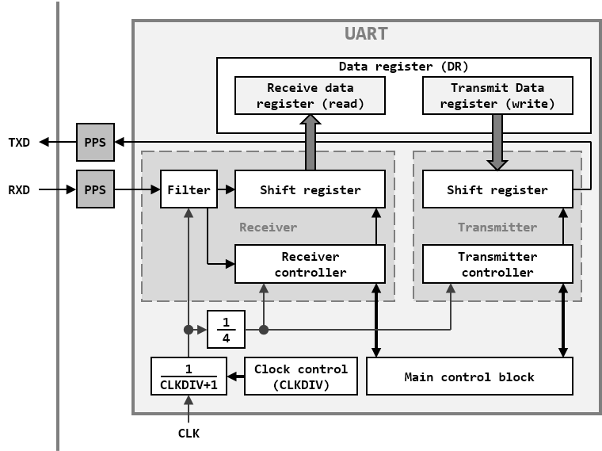
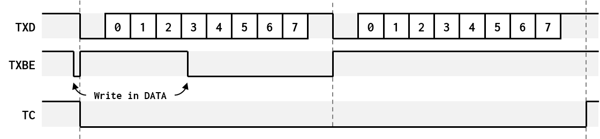
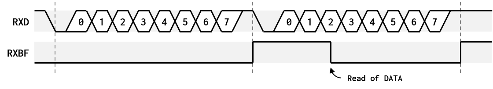

## Universal Asynchronous Receiver Transmitter (UART)

<br>UART1 base address : 0x40020000
<br>UART2 base address : 0x40020400
<br>UART3 base address : 0x40020800
<br>UART4 base address : 0x40020C00

The Universal Asynchronous Receiver Transmitter module is a full duplex serial communication peripheral. It contains a programmable baud rate generator, shift registers and data buffers to perform serial communications independently of program execution.

##### UART BLOCK DIAGRAM:


### Timings

The baud rate generator does not include internal oscillator. The main clock of the peripheral is provided by the system. Both transmitter and receiver use the same baud rate generator. The baud rate value is determined by the CLKDIV value of control register 2 (CR2), using the following equation: F<sub>baudrate</sub>=F<sub>clk</sub>/4x(CLKDIV+1)

The CLKDIV value can be calculated from the desired baud rate value: CLKDIV=F<sub>clk</sub>-2xF<sub>baudrate</sub>/4xF<sub>baudrate</sub>

### Communication

The UART module sends and receives 8-bit data with Least Significant Bit (LSB) first, preceded by a start bit (‘0’) and followed by one or more stop bit (‘1’).
At initialization, the TXBE flag and the TC flag are set. When the peripheral is enabled, writing to DATA register clears the TXBE flag. If the TXBE flag is cleared and no transfer is ongoing, the hardware set the TXBE flag, clear the TC flag, load the content of the transmit data register into the transmitter shifter and start the transmission through TXD output. At the end of the transmission, if the TXBE flag is cleared the hardware set the TXBE flag, load the content of the transmit data register into the transmitter shifter and start a new transmission. If the TXBE is set, the TC flag is set by the hardware.

##### TRANSMISSION:


A reception starts when the start bit is detected on RXD input. The hardware shift the received content into the receiver shifter until the end of frame is detected. If the stop bit is correct (‘1’), the value of the shifter is then copied to the receive data register and the RXBF flag is set. If there is no stop bit and the shifter is filled by zeros, the BRKR flag is set to indicate a break. Otherwise the FRERR is set to indicate a framing error. The RXBF is cleared when reading the DATA register. The other flags, BRKR and FRERR, must be cleared by software.

##### RECEPTION:


### Registers description

#### UART TRANSMIT AND RECEIVE DATA REGISTER (DATA: BASE+0x00)

| Bit-31 | Bit-30 | Bit-29 | Bit-28 | Bit-27 | Bit-26 | Bit-25| Bit-24| Bit-23| Bit-22| Bit-21| Bit-20| Bit-19  | Bit-18|  Bit-17 | Bit-16 |
|:------:|:------:|:------:|:------:|:------:|:------:|:-----:|:-----:|:-----:|:-----:|:-----:|:-----:|:-------:|:-----:|:-------:|:------:|
| U-0    | U-0    | U-0    | U-0    | U-0    | U-0    | U-0   | U-0   | U-0   | U-0   | U-0   | U-0   | U-0     | U-0   | U-0     | U-0    |
| -      | -      | -      | -      | -      |-       | -     | -     | -     | -     | -     | -     | -       | -     | -       | -      |

<table>
<thead>
  <tr>
    <th>Bit-15</th>
    <th>Bit-14</th>
    <th>Bit-13</th>
    <th>Bit-12</th>
    <th>Bit-11</th>
    <th>Bit-10</th>
    <th>Bit-9</th>
    <th>Bit-8</th>
    <th>Bit-7</th>
    <th>Bit-6</th>
    <th>Bit-5</th>
    <th>Bit-4</th>
    <th>Bit-3</th>
    <th>Bit-2</th>
    <th>Bit-1</th>
    <th>Bit-0</th>
  </tr>
</thead>
<tbody>
  <tr>
    <td>U-0</td>
    <td>U-0</td>
    <td>U-0</td>
    <td>U-0</td>
    <td>U-0</td>
    <td>U-0</td>
    <td>U-0</td>
    <td>U-0</td>
    <td>R/W-0</td>
    <td>R/W-0</td>
    <td>R/W-0</td>
    <td>R/W-0</td>
    <td>R/W-0</td>
    <td>R/W-0</td>
    <td>R/W-0</td>
    <td>R/W-0</td>
  </tr>
  <tr>
    <td>-</td>
    <td>-</td>
    <td>-</td>
    <td>-</td>
    <td>-</td>
    <td>-</td>
    <td>-</td>
    <td>-</td>
    <td colspan="8">DATA&lt;7:0&gt;</td>
  </tr>
</tbody>
</table>

- Bit 15-8 **Unimplemented:** read as ‘0’

- Bit 7-0 **DATA:** 
<br>Transmit and receive buffer
<br>On read: receive buffer.
<br>On write: transmit buffer.

#### UART STATUS REGISTER (STATUS: BASE+0x04)

| Bit-31 | Bit-30 | Bit-29 | Bit-28 | Bit-27 | Bit-26 | Bit-25| Bit-24| Bit-23| Bit-22| Bit-21| Bit-20| Bit-19  | Bit-18|  Bit-17 | Bit-16 |
|:------:|:------:|:------:|:------:|:------:|:------:|:-----:|:-----:|:-----:|:-----:|:-----:|:-----:|:-------:|:-----:|:-------:|:------:|
| U-0    | U-0    | U-0    | U-0    | U-0    | U-0    | U-0   | U-0   | U-0   | U-0   | U-0   | U-0   | U-0     | U-0   | U-0     | U-0    |
| -      | -      | -      | -      | -      |-       | -     | -     | -     | -     | -     | -     | -       | -     | -       | -      |

| Bit-15 | Bit-14 | Bit-13 | Bit-12 | Bit-11 | Bit-10 | Bit-9 | Bit-8 | Bit-7 | Bit-6 | Bit-5 | Bit-4 |  Bit-3  | Bit-2 |  Bit-1  | Bit-0  |
|:------:|:------:|:------:|:------:|:------:|:------:|:-----:|:-----:|:-----:|:-----:|:-----:|:-----:|:-------:|:-----:|:-------:|:------:|
| U-0    | U-0    | U-0    | U-0    | U-0    | U-0    | U-0   | U-0   | U-0   | U-0   | R/C-0 | R/C-0 | R-1     | R-1   | R-0     | U-0    |
| -      | -      | -      | -      | -      |-       | -     | -     | -     | -     | BRKR  | FRERR | TC      | TXBE  | RXBF    | -      |

- Bit 15-6 **Unimplemented:** read as ‘0’

- Bit 5 **BRKR:** 
<br>Break received flag
<br>This bit is set by hardware only and cleared by software.

- Bit 4 **FRERR:** 
<br>Framing error flag
<br>A framing error occurs when the stop bit is low, except on break received.
<br>This bit is set by hardware only and cleared by software.

- Bit 3 **TC:** 
<br>Transfer completed flag
<br>Indicates that all data inside the transmit shifter have been sent and there is no more data in the transmit buffer register.
<br>This bit is set and cleared by hardware only.

- Bit 2 **TXBE:** 
<br>Transmit buffer empty flag
<br>Indicates that the transmit buffer register is empty.
<br>This bit is set and cleared by hardware only.

- Bit 1 **RXBF:** 
<br>Receive buffer full flag
<br>Indicates that the receive buffer register is full.
<br>This bit is set and cleared by hardware only.

- Bit 0 **Unimplemented:** read as ‘0’

#### UART CONTROL REGISTER 1 (CR1: BASE+0x08)

| Bit-31 | Bit-30 | Bit-29 | Bit-28 | Bit-27 | Bit-26 | Bit-25| Bit-24| Bit-23| Bit-22| Bit-21| Bit-20| Bit-19  | Bit-18|  Bit-17 | Bit-16 |
|:------:|:------:|:------:|:------:|:------:|:------:|:-----:|:-----:|:-----:|:-----:|:-----:|:-----:|:-------:|:-----:|:-------:|:------:|
| U-0    | U-0    | U-0    | U-0    | U-0    | U-0    | U-0   | U-0   | U-0   | U-0   | U-0   | U-0   | U-0     | U-0   | U-0     | U-0    |
| -      | -      | -      | -      | -      |-       | -     | -     | -     | -     | -     | -     | -       | -     | -       | -      |

| Bit-15 | Bit-14 | Bit-13 | Bit-12 | Bit-11 | Bit-10 | Bit-9 | Bit-8 | Bit-7 | Bit-6 | Bit-5 | Bit-4  |  Bit-3  | Bit-2 |  Bit-1 | Bit-0  |
|:------:|:------:|:------:|:------:|:------:|:------:|:-----:|:-----:|:-----:|:-----:|:-----:|:------:|:-------:|:-----:|:------:|:------:|
| U-0    | U-0    | U-0    | U-0    | U-0    | U-0    | U-0   | U-0   | U-0   | U-0   | R/W-0 | R/W-0  | R/W-0   | R/W-0 | R/W-0  | R/W-0  |
| -      | -      | -      | -      | -      |-       | -     | -     | -     | -     | BRKRIE| FRERRIE| TCIE    | TXBEIE| RXBFIE | PE     |

- Bit 15-6 **Unimplemented:** read as ‘0’

- Bit 5 **BRKRIE:** 
<br>Break received interrupt enable
<br>Enable interrupt when BRKR flag is set.

- Bit 4 **FRERRIE:** 
<br>Framing error interrupt enable
<br>Enable interrupt when FRERR flag is set.

- Bit 3 **TCIE:** 
<br>Transfer completed interrupt enable
<br>Enable interrupt when TC flag is set.

- Bit 2 **TXBEIE:** 
<br>Transmit buffer empty interrupt enable
<br>Enable interrupt when TXBE flag is set.

- Bit 1 **RXBFIE:** 
<br>Receive buffer full interrupt enable
<br>Enable interrupt when RXBF flag is set.

- Bit 0 **PE:**
<br>Peripheral enable

#### UART CONTROL REGISTER 2 (CR2: BASE+0x0C)

| Bit-31 | Bit-30 | Bit-29 | Bit-28 | Bit-27 | Bit-26 | Bit-25| Bit-24| Bit-23| Bit-22| Bit-21| Bit-20| Bit-19  | Bit-18|  Bit-17 | Bit-16 |
|:------:|:------:|:------:|:------:|:------:|:------:|:-----:|:-----:|:-----:|:-----:|:-----:|:-----:|:-------:|:-----:|:-------:|:------:|
| U-0    | U-0    | U-0    | U-0    | U-0    | U-0    | U-0   | U-0   | U-0   | U-0   | U-0   | U-0   | U-0     | U-0   | U-0     | U-0    |
| -      | -      | -      | -      | -      |-       | -     | -     | -     | -     | -     | -     | -       | -     | -       | -      |

<table>
<thead>
  <tr>
    <th>Bit-15</th>
    <th>Bit-14</th>
    <th>Bit-13</th>
    <th>Bit-12</th>
    <th>Bit-11</th>
    <th>Bit-10</th>
    <th>Bit-9</th>
    <th>Bit-8</th>
    <th>Bit-7</th>
    <th>Bit-6</th>
    <th>Bit-5</th>
    <th>Bit-4</th>
    <th>Bit-3</th>
    <th>Bit-2</th>
    <th>Bit-1</th>
    <th>Bit-0</th>
  </tr>
</thead>
<tbody>
  <tr>
    <td>R/W-0</td>
    <td>R/W-0</td>
    <td>R/W-0</td>
    <td>R/W-0</td>
    <td>R/W-0</td>
    <td>R/W-0</td>
    <td>R/W-0</td>
    <td>R/W-0</td>
    <td>R/W-0</td>
    <td>R/W-0</td>
    <td>R/W-0</td>
    <td>R/W-0</td>
    <td>R/W-0</td>
    <td>R/W-0</td>
    <td>R/W-0</td>
    <td>R/W-0</td>
  </tr>
  <tr>
    <td colspan="16">CLKDIV&lt;15:0&gt;</td>
  </tr>
</tbody>
</table>

- Bit 15-0 **CLKDIV:**
<br>Clock division value

### Register map

<table>
<thead>
  <tr>
    <th rowspan="2">Register</th>
    <th rowspan="2">Offset</th>
    <th colspan="32">Bits</th>
    <th rowspan="2">Reset value</th>
  </tr>
  <tr>
    <td>31</td>
    <td>30</td>
    <td>29</td>
    <td>28</td>
    <td>27</td>
    <td>26</td>
    <td>25</td>
    <td>24</td>
    <td>23</td>
    <td>22</td>
    <td>21</td>
    <td>20</td>
    <td>19</td>
    <td>18</td>
    <td>17</td>
    <td>16</td>
    <td>15</td>
    <td>14</td>
    <td>13</td>
    <td>12</td>
    <td>11</td>
    <td>10</td>
    <td>9</td>
    <td>8</td>
    <td>7</td>
    <td>6</td>
    <td>5</td>
    <td>4</td>
    <td>3</td>
    <td>2</td>
    <td>1</td>
    <td>0</td>
  </tr>
</thead>
<tbody>
  <tr>
    <td>DATA</td>
    <td>000</td>
    <td>-</td>
    <td>-</td>
    <td>-</td>
    <td>-</td>
    <td>-</td>
    <td>-</td>
    <td>-</td>
    <td>-</td>
    <td>-</td>
    <td>-</td>
    <td>-</td>
    <td>-</td>
    <td>-</td>
    <td>-</td>
    <td>-</td>
    <td>-</td>
    <td>-</td>
    <td>-</td>
    <td>-</td>
    <td>-</td>
    <td>-</td>
    <td>-</td>
    <td>-</td>
    <td>-</td>
    <td colspan="8">DATA&lt;7:0&gt;</td>
    <td>0000</td>
  </tr>
  <tr>
    <td>STATUS</td>
    <td>004</td>
    <td>-</td>
    <td>-</td>
    <td>-</td>
    <td>-</td>
    <td>-</td>
    <td>-</td>
    <td>-</td>
    <td>-</td>
    <td>-</td>
    <td>-</td>
    <td>-</td>
    <td>-</td>
    <td>-</td>
    <td>-</td>
    <td>-</td>
    <td>-</td>
    <td>-</td>
    <td>-</td>
    <td>-</td>
    <td>-</td>
    <td>-</td>
    <td>-</td>
    <td>-</td>
    <td>-</td>
    <td>-</td>
    <td>-</td>
    <td>BRKR</td>
    <td>FRERR</td>
    <td>TC</td>
    <td>TXBE</td>
    <td>RXBF</td>
    <td>-</td>
    <td>000C</td>
  </tr>
  <tr>
    <td>CR1</td>
    <td>008</td>
    <td>-</td>
    <td>-</td>
    <td>-</td>
    <td>-</td>
    <td>-</td>
    <td>-</td>
    <td>-</td>
    <td>-</td>
    <td>-</td>
    <td>-</td>
    <td>-</td>
    <td>-</td>
    <td>-</td>
    <td>-</td>
    <td>-</td>
    <td>-</td>
    <td>-</td>
    <td>-</td>
    <td>-</td>
    <td>-</td>
    <td>-</td>
    <td>-</td>
    <td>-</td>
    <td>-</td>
    <td>-</td>
    <td>-</td>
    <td>BRKRIE</td>
    <td>FRERRIE</td>
    <td>TCIE</td>
    <td>TXBEIE</td>
    <td>RXBFIE</td>
    <td>PE</td>
    <td>0000</td>
  </tr>
  <tr>
    <td>CR2</td>
    <td>00C</td>
    <td>-</td>
    <td>-</td>
    <td>-</td>
    <td>-</td>
    <td>-</td>
    <td>-</td>
    <td>-</td>
    <td>-</td>
    <td>-</td>
    <td>-</td>
    <td>-</td>
    <td>-</td>
    <td>-</td>
    <td>-</td>
    <td>-</td>
    <td>-</td>
    <td colspan="16">CLKDIV&lt;15:0&gt;</td>
    <td>0000</td>
  </tr>
</tbody>
</table>

### Example driver

```c
#define USE_INTERUPT

static volatile char UART1_TxBuffer[UART1_TXBUFFERSIZE];
static volatile int UART1_TxFirst, UART1_TxLast, UART1_TxCount;

static volatile char UART1_RxBuffer[UART1_RXBUFFERSIZE];
static volatile int UART1_RxFirst, UART1_RxLast, UART1_RxCount;


void UART1_Init(unsigned int baudrate)
{
	RSTCLK.UART1EN = 1;

	UART1.PE = 0;

	UART1.CLKDIV = (SYSCLK - 2*baudrate)/(4*baudrate);

	UART1_TxFirst = UART1_TxLast = UART1_TxCount = 0;
	UART1_RxFirst = UART1_RxLast = UART1_RxCount = 0;

	UART1.RXBFIE = 1;
}


void UART1_Clean(void)
{
	UART1.TXBEIE = 0;
	UART1.RXBFIE = 0;

	UART1_TxFirst = UART1_TxLast = UART1_TxCount = 0;
	UART1_RxFirst = UART1_RxLast = UART1_RxCount = 0;

	UART1.RXBFIE = 1;
}


int UART1_IsRxNotEmpty(void)
{
	return (UART1_RxFirst != UART1_RxLast);
}


char UART1_Read(void)
{
	char c;

	if (UART1_RxFirst == UART1_RxLast)
	{
		UART1_RxCount = 0;
		return 0;
	}

	c = UART1_RxBuffer[UART1_RxLast++];
	UART1_RxCount--;

	if (UART1_RxLast >= UART1_RXBUFFERSIZE)
		UART1_RxLast = 0;

	return c;
}


void UART1_Write(const char c)
{
	if (UART1_TxCount >= UART1_TXBUFFERSIZE - 2)
		return;

	UART1.TXBEIE = 0;

	UART1_TxBuffer[UART1_TxFirst++] = c;
	UART1_TxCount++;

	if (UART1_TxFirst >= UART1_TXBUFFERSIZE)
		UART1_TxFirst = 0;

	UART1.TXBEIE = 1;

	#ifndef USE_INTERUPT

		UART1.DATA = UART1_TxBuffer[UART1_TxLast++];
		UART1_TxCount--;

		if (UART1_TxLast >= UART1_TXBUFFERSIZE)
			UART1_TxLast = 0;

		while (!(UART1.TXBE));

		UART1.TXBEIE = 0;

	#endif
}


#ifdef USE_INTERUPT
void UART1_IRQHandler(void) __attribute__((interrupt));
void UART1_IRQHandler(void) {
	if (UART1.RXBFIE && UART1.RXBF)
	{
		UART1_RxBuffer[UART1_RxFirst] = UART1.DATA;

		if (UART1_RxCount < UART1_RXBUFFERSIZE - 2)
		{
			UART1_RxFirst++;
			UART1_RxCount++;

			if (UART1_RxFirst >= UART1_RXBUFFERSIZE)
				UART1_RxFirst = 0;
		}
	}

	if (UART1.TXBEIE && UART1.TXBE)
	{
		if (UART1_TxFirst == UART1_TxLast)
		{
			UART1_TxCount = 0;
			UART1.TXBEIE = 0;
		}
		else
		{
			UART1.DATA = UART1_TxBuffer[UART1_TxLast++];
			UART1_TxCount--;

			if (UART1_TxLast >= UART1_TXBUFFERSIZE)
				UART1_TxLast = 0;
		}
	}
}

#endif
```
